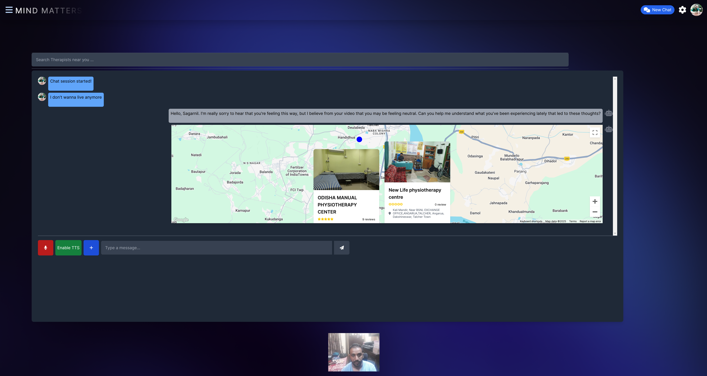

# Mind-Matters: A Multi-Modal Mental Health Assistant


**Overview**
------------

**Mind-Matters** is a state-of-the-art multi-modal mental health assistant designed to act as a supplement to trained psychiatrists. It integrates advanced AI models with real-time user interactions to provide insights, recommendations, and assistance tailored to users' mental health needs. The system leverages cutting-edge technologies in Natural Language Processing (NLP), Computer Vision, and database management to deliver a seamless, empathetic, and secure mental health support experience.

* * * * *

**Key Features**
----------------

### **1\. Multi-Modal Analysis**

-   **Sentiment Analysis**: Powered by a fine-tuned RoBERTa model to detect user sentiments with high accuracy.


-   **Suicide Prediction**: Uses the ELECTRA model to identify distress and suicidal tendencies in user interactions.



-   **Intent Recognition**: Employs a T5-based intent detection model for understanding user queries effectively.
-   **Emotion Detection**: Utilizes the FER library to analyze real-time facial expressions through video input.
-   **Visual Question Answering (VQA)**: Integrated with the "blip-vqa-base" model to interpret and respond to user-uploaded images.
-   **Speech Recognition**: Allows users to interact through voice, with added tonal analysis for nuanced understanding.

* * * * *

### **2\. Real-Time Recommendations**

-   **Article Recommendations**: Suggests mental health articles using vector-based similarity searches through Pinecone.
-   **Motivational Quotes & Exercises**: Tailored daily suggestions to uplift the user's mental state.
-   **Therapist Locator**: Uses Google Maps API to recommend nearby mental health professionals.
-   **Daily Insights**: Provides summaries of user interactions, highlighting key emotional trends.

* * * * *

### **3\. User-Centric Design**

-   **Personalized Interactions**: GPT-3.5 bot fine-tuned with RAG and PEFT pipelines for empathetic and meaningful conversations.
-   **User Profiles**: Stores demographic and interaction data securely for personalized assistance.
-   **Emergency Support**: Detects critical mental health states and alerts emergency contacts as needed.
-   **Group Support**: Enables focus group creation with similar users (consent-based).

* * * * *

### **4\. Robust Backend Architecture**

-   **FastAPI Backend**: Deployed as microservices in a Kubernetes cluster, ensuring horizontal and vertical scalability.
-   **PostgreSQL & Pinecone Databases**: Efficiently manage raw data and high-dimensional vector embeddings.
-   **Caching with Redis**: Enhances performance by caching frequently accessed data.
-   **AWS Deployment**: Backend and frontend hosted in AWS environments for high availability.

* * * * *

**Technical Implementation**
----------------------------

### **1\. Core Modules**

#### **AI-Based Analysis**

-   **RoBERTa**: Fine-tuned for sentiment detection in mental health contexts.
-   **ELECTRA**: Identifies subtle cues for suicidal tendencies with high efficiency.
-   **T5 for Intent Recognition**: Provides intent categorization for user queries.
-   **FER for Emotion Detection**: Real-time facial expression analysis ensures accurate emotional feedback.

#### **User Interaction**

-   **Websocket Communication**: Enables real-time chat and video analysis.
-   **Secure Chat Logs**: Encrypts and stores user interactions for retrospective insights.

#### **Database Management**

-   **PostgreSQL**: Manages structured user data.
-   **Pinecone Vector Database**: Stores embeddings for fast similarity searches.

* * * * *

### **2\. Scalability & Security**

-   **Microservices Architecture**: Facilitates seamless scaling for concurrent users.
-   **Ingress & Load Balancing**: Supports efficient traffic management.
-   **CORS Middleware**: Ensures secure communication between frontend and backend.
-   **Encrypted Sessions**: Protects user data in transit and at rest.

* * * * *

**Advantages**
--------------

1.  **Real-Time Insights**: Instantaneous feedback ensures timely assistance.
2.  **Empathetic Interactions**: Fine-tuned AI models mimic human empathy for better user engagement.
3.  **Safety-Oriented Design**: Detects and acts on critical mental health risks.
4.  **Scalability**: Designed to support hundreds of thousands of concurrent users.
5.  **Data-Driven Recommendations**: Advanced vector-based methods provide personalized and contextually relevant content.

* * * * *

**Future Scope**
----------------

-   Integration of more AI models for enhanced analysis.
-   Expanding functionalities to support diverse user needs.
-   Enhanced group therapy support and gamified challenges for mental health improvement.

* * * * *

### **Getting Started**

* * * * *

### **1\. Clone the Repository**

`git clone https://github.com/sagarnildass/mind-matters.git`

* * * * *

### **2\. Install Dependencies**

#### **Backend**

Navigate to the backend directory and install Python packages:

```
cd backend
pip install -r requirements.txt
```

#### **Frontend**

Navigate to the frontend directory and install dependencies:

```
cd frontend
npm install
```

* * * * *

### **3\. Configure Environment Variables**

#### **Backend (`.env`)**

1.  Create a `.env` file in the `backend` directory based on the `env.example` file:


    ```
    OPENAI_API_KEY=your-openai-api-key
    PINECONE_API_KEY=your-pinecone-api-key
    GOOGLE_API_KEY=your-google-api-key
    AWS_ACCESS_KEY_ID=your-aws-access-key-id
    AWS_SECRET_ACCESS_KEY=your-aws-secret-access-key

    DB_HOST=your-database-host
    DB_PORT=5432
    DB_NAME=your-database-name
    DB_USER=your-database-username
    DB_PASSWORD=your-database-password
    ```

2.  Replace placeholders with your actual credentials.

#### **Frontend (`.env.local`)**

1.  Create a `.env.local` file in the `frontend` directory based on the `env.example` file:

    ```
    VITE_APP_API_URL=your-backend-api-base-url
    VITE_GOOGLE_MAPS_API_KEY=your-google-maps-api-key
    ```

2.  Replace placeholders with your actual credentials.

* * * * *

### **4\. Run the Application**

#### **Backend**

Go to the "backend" directory and start the backend server:


```
cd backend
uvicorn main:app --host 0.0.0.0 --port 8000 --reload
```

#### **Frontend**

Go to the "frontend" directory and start the frontend development server:

```
cd frontend
npm run dev
```

* * * * *

### **5\. Access the Application**

-   The frontend will be available at: `http://localhost:5173`
-   The backend will be available at: `http://localhost:8000`

* * * * *

### **Notes**

-   Ensure that `.env` and `.env.local` are added to `.gitignore` to avoid committing sensitive information.
-   For production, configure environment variables directly on the hosting platform (e.g., AWS, Vercel).
* * * * *

**Contributing**
----------------

Contributions are welcome! Feel free to fork the repository, submit pull requests, or raise issues for any bugs or feature requests.

* * * * *

**License**
-----------

This project is licensed under the GNU Affero General Public License v3.0 (AGPL-3.0).

The full text of the GNU Affero General Public License v3.0 is included in the LICENSE file in this repository. You can also read it [here](https://github.com/sagarnildass/mind-matters/blob/master/LICENSE).

* * * * *

**Mind-Matters** is a step towards bridging the gap between technology and mental health care. Together, we can make mental health support accessible and impactful for everyone.